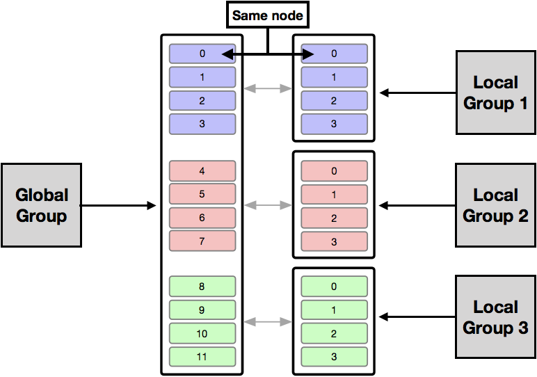
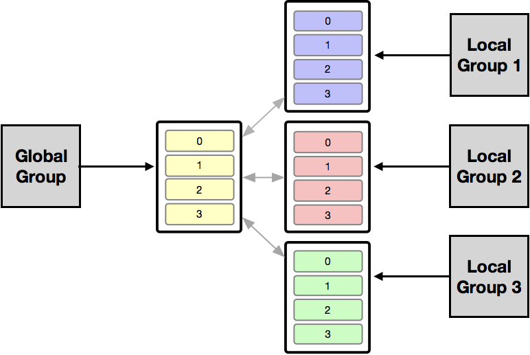

#README
This branch is the work in the direction of batching with async comunication and no auxiliary replicas.
At the moment is not working proerly and stop processing after a while.

# ByzCast

**ByzCast** is a proof of concept of a partial-genuine byzantine atomic multicast protocol using as base to implementation the library **[BFT-SMaRt][1]**. 
The idea behind this project is simple: we use multiple groups of instances of BFT-SMART and the data are partitioned between these groups. 
Messages addressed only to one group are routed locally and messages addressed to multiple groups are forwarded to a global group. 
After the global consensus the message is forwarded to the corresponding local(s) group(s).

[1]: https://github.com/bft-smart/library

## Installation

This project requires Java Runtime Environment 1.8 and Maven. 
To compile:
   
    mvn package

## Usage

Sample scripts to run both server and client side can be found in the ``script`` folder.

### History

This project started as a simple proof of concept that is possible to construct a partial-genuine atomic multicast protocol using the classic approach in broadcast consensus protocols currently available, 
in this case [BFT-SMaRt][1] library, a replication library written in Java designed to tolerate Byzantine fault that implements state machine replication.

The basic idea behind this PoC started by deploying 

And this is the second version
 

## Credits

TODO: Write credits.

## Contributing

1. Fork it
2. Create your feature branch: `git checkout -b my-new-feature`
3. Commit your changes: `git commit -am 'Add some feature'`
4. Push to the branch: `git push origin my-new-feature`
5. Submit a pull request

## License

ByzCast - A (hopeful) high-throughput BFT Atomic Multicast implementation
Copyright (C) 2017, University of Lugano

This file is part of ByzCast.

BFT-SWARM is free software; you can redistribute it and/or
modify it under the terms of the GNU Lesser General Public
License as published by the Free Software Foundation; either
version 2.1 of the License, or (at your option) any later version.

This library is distributed in the hope that it will be useful,
but WITHOUT ANY WARRANTY; without even the implied warranty of
MERCHANTABILITY or FITNESS FOR A PARTICULAR PURPOSE.  See the GNU
Lesser General Public License for more details.

You should have received a copy of the GNU Lesser General Public
License along with this library; if not, write to the Free Software
Foundation, Inc., 51 Franklin Street, Fifth Floor, Boston, MA  02110-1301  USA